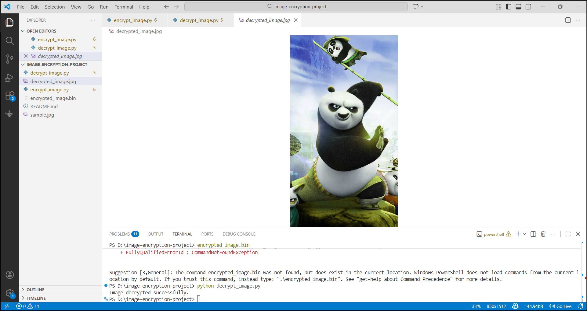

# Image Encryption Using Cryptography

## Project Overview
This project is a Python-based application that encrypts and decrypts images using cryptographic techniques. The goal of this project is to protect image files so that only users with the correct secret key can access the original image.

The system uses AES encryption along with a randomly generated salt and Initialization Vector (IV) to improve security. Even if the same image is encrypted multiple times, the output will be different due to the random IV.

This project uses the cryptography library maintained by the PyCA community and the Pillow library for handling image files.

## Objectives
- Encrypt image files securely
- Decrypt images using a secret key
- Use random salt and IV for each encryption
- Demonstrate secure cryptographic practices

## Technologies Used
- Python
- cryptography library
- Pillow (PIL)

## Features
- Secure AES image encryption
- Random salt generation
- Random IV generation
- Password-based key derivation
- Image decryption support
- Works with binary image data

## How the Project Works
1. The user provides an image file.
2. The system reads the image as binary data.
3. A secret key is generated using password-based key derivation.
4. A random salt and IV are created.
5. AES encryption is applied to the image data.
6. The encrypted file is stored securely.
7. The image can be decrypted using the same key.

## Installation

Install required libraries:

pip install cryptography pillow

## How to Run

Step 1: Encrypt the image

python encrypt_image.py

Step 2: Decrypt the image

python decrypt_image.py

## Project Screenshot

## Project Structure

image-encryption-project
│
├── encrypt_image.py
├── decrypt_image.py
├── sample.jpg
└── README.md

## Learning Outcomes
- Understanding binary data encryption
- Secure key derivation techniques
- Working with AES encryption
- Understanding cryptographic modes of operation
- Handling image files securely

## Important Note
This project is developed for educational purposes to understand cryptography and secure data handling.

## Author
Pranoti Dangore

